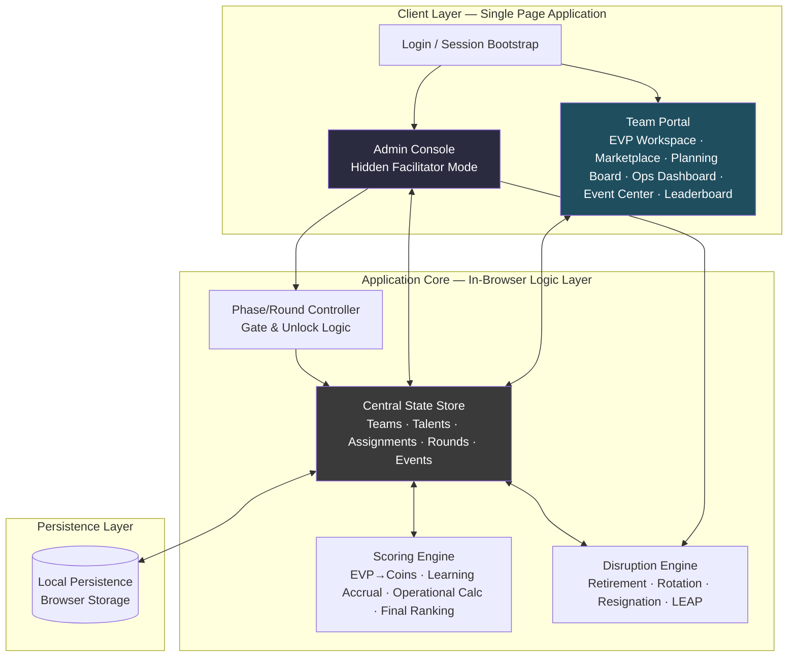
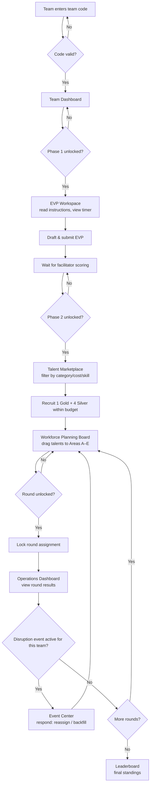
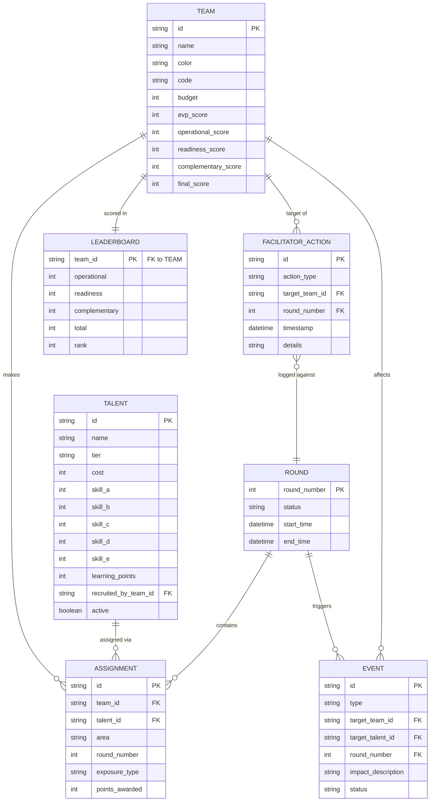

# Workforce Strategy Simulation Platform
## Expanded Product Requirements & Technical Design Document

**Version:** 1.0 (Design Phase — Pre-Development)
**Status:** For Review — No code generated per Master Cowork Instruction
**Document Owner:** Product/Facilitation Design

---

## Table of Contents
1. [Expanded Product Requirements Document](#1-expanded-product-requirements-document)
2. [System Architecture Diagram](#2-system-architecture-diagram)
3. [User Flow Diagrams](#3-user-flow-diagrams)
4. [Wireframe Descriptions](#4-wireframe-descriptions)
5. [Database / Data Schema](#5-database--data-schema)
6. [Technical Design Specification](#6-technical-design-specification)
7. [UI/UX Design Specification](#7-uiux-design-specification)

---

## 1. Expanded Product Requirements Document

### 1.1 Vision

The Workforce Strategy Simulation Platform is a facilitator-controlled, session-based digital simulation that teaches HR lifecycle strategy to cohorts of 6–8 competing teams. Each team acts as a business unit that must build an Employee Value Proposition (EVP), recruit talent under budget constraints, staff five operational work areas, and respond to workforce disruptions across multiple rounds — all while a facilitator orchestrates timing, scoring, and narrative events from a central console.

The platform's purpose is pedagogical: every mechanic exists to make an abstract HR concept tangible and competitively scored, so participants *feel* the consequences of workforce strategy decisions rather than just discussing them.

### 1.2 Learning Framework — Concept-to-Mechanic Mapping

| HR Discipline | Simulation Mechanic |
|---|---|
| Employee Value Proposition (EVP) | Teams draft an EVP statement/strategy in Phase 1; a scored EVP submission converts directly into starting "coins" (budget) for the game |
| Headcount (HC) Planning | Teams must plan roster composition (1 Gold + 4 Silver talents) against a fixed budget and five work-area demand profile |
| Talent Acquisition (TA) | The Talent Marketplace simulates sourcing, filtering, and competitive recruitment of a shared, depleting talent pool |
| Performance Management | Operations rounds generate a per-round Operational score based on talent-to-area fit and utilization |
| Reward | Budget/coin allocation trade-offs between recruitment spend and later-round investment (e.g., L&D) model total-rewards decision-making |
| Learning & Development (L&D) | Talents accumulate "Learning" points via New Exposure, Specialization, and Repeated Exposure mechanics, capped at 100, which feed the Readiness score |
| Succession Planning | Teams must maintain bench depth across A–E areas so a Retirement/Resignation disruption doesn't leave an area uncovered |
| Exit & Mobility | The Disruption Engine triggers Retirement, Rotation, Resignation, and LEAP (lateral/expansion/attrition/promotion-type) events that force mid-game reallocation |

### 1.3 User Roles

| Role | Description | Access |
|---|---|---|
| **Facilitator (Admin)** | Runs the session end-to-end: creates teams, unlocks phases, starts/stops timers, enters or approves scores, triggers disruption events, publishes leaderboard, declares the winner | Hidden Admin Console, full override rights |
| **Team Player** | Represents one of 6–8 competing teams; interacts only with their own team's workspace, marketplace view, and planning board | Team-scoped login via team code |
| **Observer (optional/future)** | Read-only view of the live leaderboard for spectators | Leaderboard only |

### 1.4 Core Modules

1. **Authentication & Session Bootstrap** — team-code login, facilitator hidden-mode entry
2. **EVP Workspace** — Phase 1 submission tool, timer-bound
3. **Talent Marketplace** — Phase 2 recruitment tool, shared/depleting pool
4. **Workforce Planning Board** — drag-and-drop assignment of talents to Areas A–E
5. **Operations Dashboard** — Phase 3 round-by-round production/readiness view
6. **Event Center** — displays active/triggered disruption events and required team responses
7. **Leaderboard** — live rankings across Operational, Readiness, and Complementary Team scores
8. **Admin Console** — facilitator-only phase, timer, scoring, and disruption controls
9. **Scoring Engine** (backend logic, not a screen) — computes EVP coins, learning points, and round scores
10. **Disruption Engine** (backend logic, not a screen) — selects, applies, and logs workforce disruption events

### 1.5 Game Rules (Expanded)

- **Team count:** 2–8 teams per session (design ceiling: 8); each team is assigned a unique code, name, and color.
- **Roster composition:** each team recruits exactly **1 Gold-tier talent** and **4 Silver-tier talents** (5 total roster seats) from a shared marketplace pool.
- **Budget:** each team's starting budget ("coins") is a direct function of their Phase 1 EVP score — stronger EVP submissions yield more purchasing power in Phase 2. This creates an intentional causal chain: *EVP quality → recruiting power → roster quality → operational ceiling.*
- **Work areas:** five functional areas, **A through E**, each requiring talent coverage; talents carry per-area skill ratings that determine fit.
- **Rounds:** the simulation runs across **multiple sequential rounds** (recommended default: 3–5, facilitator-configurable), each consisting of an assignment step, a production/scoring step, and a possible disruption event.
- **Facilitator gating:** teams cannot advance to a phase or round until the facilitator explicitly unlocks it — this keeps all teams synchronized and lets the facilitator control pacing and inject events at chosen moments.

### 1.6 Detailed Formula Library

**EVP → Coins Conversion**
```
starting_budget (coins) = f(EVP_score)
```
The EVP score, assigned by the facilitator (or a rubric-assisted input) during Phase 1 review, is converted 1:1 (or via a configurable multiplier) into the team's coin balance for recruitment.

**Learning Point Accrual (per talent, per round)**
| Event | Points | Notes |
|---|---|---|
| New Exposure | +15 | Talent assigned to an Area they have not previously worked |
| Specialization | +8 | Talent re-assigned to the *same* area they excelled in previously (deepening, not broadening) |
| Repeated Exposure | +12 | Talent assigned to an area worked before, but not the most recent one (reinforcement) |
| **Cap** | **100** | Learning score per talent cannot exceed 100 regardless of accrued events |

**Readiness Score**
```
Readiness = normalized aggregate of team's Learning points across all 5 rostered talents
```

**Operational Score**
```
Operational = round-over-round production output, driven by talent-to-area skill fit and utilization
```

**Winner / Final Ranking Formula**
```
Final Score = (0.40 × Operational Score) + (0.40 × Readiness Score) + (0.20 × Complementary Team Score)
```
- **Complementary Team Score** rewards balanced roster construction (skill coverage across all five areas rather than over-concentration), operationalized as a diversity/coverage index over the team's 5-talent skill matrix.

### 1.7 Phase Specifications

**Phase 1 — EVP to Coins**
- Teams receive instructions and a countdown timer.
- Teams submit an EVP strategy/statement via the EVP Workspace submission panel.
- Facilitator reviews and scores each submission (in-app scoring field in Admin Console).
- Score converts to starting coin balance, unlocking Phase 2.

**Phase 2 — Recruitment and HC Planning**
- Talent Marketplace opens with the full shared talent pool, filterable by category, cost, and skill profile.
- Teams spend coins to recruit exactly 1 Gold + 4 Silver talents.
- Marketplace is a shared, depleting resource — once a Silver or Gold talent is recruited by one team, they are removed from the pool for all others (first-come, budget-permitting).
- On roster completion, teams move to the Workforce Planning Board to make initial Area A–E assignments.

**Phase 3 — Operations and People Development**
- Runs across N facilitator-defined rounds.
- Each round: teams assign/re-assign talents to Areas A–E on the Planning Board → facilitator starts the round timer → teams lock submissions → facilitator enters/approves production results → Scoring Engine computes Operational + Learning updates → Disruption Engine may trigger an event → Leaderboard updates → facilitator unlocks next round.
- Disruption types: **Retirement** (talent permanently removed, area must be backfilled), **Rotation** (talent forced to move areas), **Resignation** (talent removed, replacement may be sourced from a secondary pool if configured), **LEAP** (a special multi-effect event — e.g., a lateral move plus an expansion opportunity — configurable per session).

### 1.8 Facilitator Workflow (Expanded)

| Stage | Facilitator Actions |
|---|---|
| **Pre-Game** | Create/import teams (name, color, code); load or configure the talent pool dataset; set number of rounds; configure EVP-to-coin multiplier |
| **Phase Control** | Sequentially unlock Phase 1 → Phase 2 → Phase 3 rounds; teams cannot self-advance |
| **Timers** | Start, pause, extend, or force-end phase/round timers from the Admin Console |
| **Collection** | Monitor submission status per team (EVP text, recruitment roster, area assignments) in real time |
| **Scoring** | Enter/approve EVP scores; enter or auto-approve production results; review Scoring Engine outputs before publishing |
| **Disruptions** | Manually trigger, or allow the Disruption Engine to randomly trigger (facilitator-approved), Retirement/Rotation/Resignation/LEAP events targeting specific teams or the whole cohort |
| **Leaderboard** | Publish/refresh the leaderboard after each round's scoring is finalized |
| **Closure** | Lock further submissions, compute final weighted score, declare and display the winning team |

### 1.9 Non-Functional Requirements

- **Session-local, no external accounts:** teams authenticate via a facilitator-issued code, not personal credentials.
- **Resilience:** in-progress team submissions must survive browser refresh (local persistence).
- **Facilitator override authority:** the facilitator can, at any time, edit any team's score, roster, or assignment to correct data-entry errors or run "what-if" scenarios live.
- **Concurrency:** the platform must support 6–8 teams submitting simultaneously within the same phase without collision (e.g., two teams racing for the same marketplace talent).
- **Transparency vs. fairness:** teams must not see other teams' in-progress (unsubmitted) work, but the shared marketplace pool state (what's already taken) must update live for all teams.
- **Auditability:** every facilitator action (score entry, disruption trigger, override) should be logged with a timestamp for post-session debrief.

### 1.10 Out of Scope (this phase)

- Persistent multi-session user accounts or cross-session history.
- Real-money or external payment integration ("coins" are simulation-internal only).
- Mobile-native apps (web-responsive SPA only).
- Actual code implementation — explicitly deferred until this design document is approved.

---

## 2. System Architecture Diagram



**Architecture notes:**
- Single-page application: one deployed artifact serves both the Team Portal and the hidden Admin Console; role is determined at login (team code vs. facilitator key/gesture).
- All game logic (scoring, disruption selection, phase gating) runs client-side in the Application Core layer — there is no separate backend server in the v1 architecture; the "shared" marketplace and leaderboard state are synchronized through the local persistence layer acting as the single source of truth for the session's browser context.
- The Central State Store is the single in-memory source of truth that every screen reads from and writes to; the Scoring and Disruption engines are pure functions/modules that operate on that state and return updated state, keeping game rules centralized and testable independent of any specific screen.

---

## 3. User Flow Diagrams

### 3.1 Team Player Flow



### 3.2 Facilitator Flow

```mermaid
flowchart TD
    A[Facilitator authenticates<br/>hidden admin entry] --> B[Admin Console]
    B --> C[Create/import teams<br/>configure rounds & multipliers]
    C --> D[Unlock Phase 1 EVP]
    D --> E[Start Phase 1 timer]
    E --> F[Monitor EVP submissions]
    F --> G[Score each team's EVP]
    G --> H[Coins auto-computed & applied]
    H --> I[Unlock Phase 2 Marketplace]
    I --> J[Monitor recruitment in real time]
    J --> K[Unlock Round N Planning]
    K --> L[Start round timer]
    L --> M[Collect/lock team assignments]
    M --> N[Enter or approve production results]
    N --> O[Scoring Engine computes Operational + Learning]
    O --> P{Trigger disruption this round?}
    P -- Yes --> Q[Select event type & target team(s)<br/>Retirement/Rotation/Resignation/LEAP]
    Q --> R[Publish event to Event Center]
    P -- No --> R
    R --> S[Publish updated Leaderboard]
    S --> T{More rounds?}
    T -- Yes --> K
    T -- No --> U[Compute Final Score<br/>40% Operational + 40% Readiness + 20% Complementary]
    U --> V[Declare winner & lock session]
```

---

## 4. Wireframe Descriptions

Each screen below is described in terms of layout regions, primary components, and key interactions — sufficient detail to move directly into visual mockups without needing to reference the PRD text.

### 4.1 Login
- **Layout:** centered single-card panel on a full-bleed background using the industrial-ops/HR-strategy visual theme.
- **Components:** team code input field, "Enter Simulation" primary button, small "Facilitator Access" affordance (deliberately understated — e.g., a small icon or keyboard shortcut) that opens the hidden Admin Console login instead of a team dashboard.
- **States:** invalid-code error state; loading state while validating.

### 4.2 Team Dashboard
- **Layout:** top navigation bar (team name/color chip, current phase indicator, countdown timer, coin balance); main content area shows a phase-status summary card ("Phase 2 unlocks in 4:12"); secondary panel with quick links to unlocked modules.
- **Components:** phase progress tracker (stepper: EVP → Recruit → Plan → Operate → Results), locked/unlocked module tiles.

### 4.3 EVP Workspace
- **Layout:** two-column — left column holds instructions/rubric text, right column holds the submission panel.
- **Components:** persistent countdown timer (top-right, color-shifts as time runs low), rich-text or structured submission form, "Save Draft" and "Submit Final" buttons, submission-locked confirmation state once submitted.

### 4.4 Talent Marketplace
- **Layout:** left filter rail (category: Gold/Silver, cost range, skill-area filter A–E), main grid/list of talent cards, right-side sticky "Your Roster" tray showing recruited slots (1 Gold + 4 Silver) and remaining budget.
- **Components:** talent card (name, tier badge, cost, radar/bar mini-chart of A–E skills, "Recruit" button that disables once a slot type is filled or budget is insufficient), live "already taken" state on cards recruited by other teams.

### 4.5 Workforce Planning Board
- **Layout:** kanban-style board with five columns labeled Area A–E; a talent tray/dock at the top or side holding unassigned roster members as draggable cards.
- **Components:** drag-and-drop talent cards, per-area capacity/fit indicator, per-talent mini badge showing accumulated Learning points and current cap proximity, "Lock Assignment" button that becomes active once all five talents are placed.

### 4.6 Operations Dashboard
- **Layout:** top summary strip (Operational score this round, Readiness score, trend arrows vs. previous round); main body split into a results table (per-talent per-area contribution) and a trend chart panel.
- **Components:** round selector/history tabs, score breakdown table, sparkline or bar trend chart, "Awaiting facilitator" banner when results are pending entry.

### 4.7 Event Center
- **Layout:** feed/timeline of triggered events, most recent at top; active/unresolved events visually flagged (badge + color) and pinned above resolved history.
- **Components:** event card (type icon — Retirement/Rotation/Resignation/LEAP, affected talent, required action), "Respond" button that deep-links to the Planning Board pre-filtered to the affected area.

### 4.8 Leaderboard
- **Layout:** full-width ranked table/card list, teams ordered by Final Score; each row expandable to reveal the Operational/Readiness/Complementary breakdown.
- **Components:** rank badges, team color chips, trend indicators (rank change since last round), expand/collapse row detail, "Final Results" banner state once the facilitator declares the winner.

### 4.9 Admin Console (Facilitator, hidden)
- **Layout:** left navigation (Teams, Phases, Scoring, Disruptions, Leaderboard, Logs); main panel changes per section; persistent top bar with global timer controls and session name.
- **Components:**
  - *Teams:* create/edit team roster, codes, colors.
  - *Phases:* unlock/lock toggles per phase and round, timer start/pause/extend controls.
  - *Scoring:* per-team EVP score entry, production result entry/approval queue.
  - *Disruptions:* event trigger panel (select type, target team(s), affected area), randomize option with facilitator confirm step.
  - *Leaderboard:* preview before publish, manual override fields, "Publish" action.
  - *Logs:* chronological audit trail of all facilitator actions.

---

## 5. Database / Data Schema

### 5.1 Entity-Relationship Overview



### 5.2 Field-Level Schema Detail

**Team**
| Field | Type | Notes |
|---|---|---|
| id | string (PK) | unique team identifier |
| name | string | display name |
| color | string | hex color for UI theming |
| code | string | login code issued by facilitator |
| budget | int | remaining coins, decremented on recruitment |
| evp_score | int | facilitator-entered, drives initial budget |
| operational_score, readiness_score, complementary_score, final_score | int | computed by Scoring Engine, refreshed each round |

**Talent**
| Field | Type | Notes |
|---|---|---|
| id | string (PK) | unique talent identifier |
| name | string | display name |
| tier | enum(Gold, Silver) | determines roster-slot eligibility |
| cost | int | coin price in Marketplace |
| skill_a..skill_e | int | per-area skill rating, drives fit/production calc |
| learning_points | int | accumulated per talent, capped at 100 |
| recruited_by_team_id | string (FK, nullable) | null while in open pool |
| active | boolean | false if removed via Retirement/Resignation |

**Assignment**
| Field | Type | Notes |
|---|---|---|
| id | string (PK) | unique assignment record |
| team_id | string (FK) | owning team |
| talent_id | string (FK) | assigned talent |
| area | enum(A,B,C,D,E) | work area placement |
| round_number | int (FK) | which round this assignment belongs to |
| exposure_type | enum(New, Specialization, Repeated) | drives Learning point award |
| points_awarded | int | Learning points from this round's placement |

**Round**
| Field | Type | Notes |
|---|---|---|
| round_number | int (PK) | sequence order |
| status | enum(Locked, Open, Submitted, Scored, Closed) | phase-gate state |
| start_time / end_time | datetime | timer bounds |

**Event**
| Field | Type | Notes |
|---|---|---|
| id | string (PK) | unique event id |
| type | enum(Retirement, Rotation, Resignation, LEAP) | disruption category |
| target_team_id | string (FK) | affected team |
| target_talent_id | string (FK) | affected talent |
| round_number | int (FK) | round the event was triggered in |
| impact_description | string | facilitator/system-generated summary |
| status | enum(Triggered, Acknowledged, Resolved) | team response tracking |

**Leaderboard**
| Field | Type | Notes |
|---|---|---|
| team_id | string (PK/FK) | one row per team |
| operational, readiness, complementary, total | int | weighted per §1.6 formula |
| rank | int | computed ordering |

**FacilitatorAction**
| Field | Type | Notes |
|---|---|---|
| id | string (PK) | unique log entry |
| action_type | enum(ScoreEntry, PhaseUnlock, TimerControl, DisruptionTrigger, Override, Publish) | |
| target_team_id | string (FK, nullable) | if action targets a specific team |
| round_number | int (FK, nullable) | if action is round-scoped |
| timestamp | datetime | audit trail ordering |
| details | string | free-text description of the override/action |

---

## 6. Technical Design Specification

### 6.1 Application Type
Single Page Application (SPA) built with HTML/CSS/JavaScript, no page reloads between screens. Routing is handled client-side (hash- or state-based) across the Login, Team Portal, and Admin Console "views."

### 6.2 State Management
- A single **Central State Store** (in-memory JS object graph mirroring the schema in §5) is the source of truth for the running session.
- All screens are **read views** over this store plus **dispatchers** that call into the Scoring Engine, Disruption Engine, or Phase Controller modules rather than mutating state directly — this keeps game-rule logic centralized and unit-testable independent of UI.
- State changes trigger a re-render of affected screen regions only (targeted DOM updates, not full-page re-render), to keep the drag-and-drop Planning Board and live-updating Marketplace responsive.

### 6.3 Persistence
- **Local persistence** (browser storage) is the v1 mechanism for durability — the full session state (teams, talents, assignments, rounds, events, logs) is serialized and saved on every meaningful state transition (submission, score entry, disruption trigger, phase unlock).
- On load, the app attempts to rehydrate from the last saved session state, so a facilitator or team refreshing mid-session does not lose progress.
- Given local persistence is browser-scoped, the intended deployment pattern is: the facilitator's device (or a shared session display) holds the authoritative state, with team devices interacting through the same running session context. (If a networked multi-device deployment is required in a later phase, this is flagged in §6.7 as a future extension requiring a shared backend/store — out of scope for this design pass.)

### 6.4 Scoring Engine (Module Design)
Pure-function module exposing:
- `computeStartingBudget(evpScore, multiplier)` → coins
- `computeExposureType(talent, area, roundHistory)` → New | Specialization | Repeated
- `awardLearningPoints(talent, exposureType)` → capped 0–100 update
- `computeOperationalScore(team, roundAssignments)` → per-round production output based on skill-to-area fit and utilization
- `computeReadinessScore(team)` → normalized aggregate of all 5 talents' learning points
- `computeComplementaryScore(team)` → skill-coverage/diversity index across Areas A–E
- `computeFinalScore(team)` → `0.40×Operational + 0.40×Readiness + 0.20×Complementary`

### 6.5 Disruption Engine (Module Design)
- Exposes a trigger interface consumed only by the Admin Console: `triggerEvent(type, targetTeamId, targetTalentId, roundNumber)`.
- Supports an optional **weighted-random suggestion mode** (facilitator requests a suggested event; engine proposes type/target; facilitator confirms or overrides before publish) to reduce facilitator cognitive load while preserving human control over pacing.
- Each event type has a defined state-mutation contract:
  - **Retirement:** talent's `active` flag → false, permanently vacates its Area, team must backfill from bench or forfeit that area's production.
  - **Rotation:** talent's current Area assignment is force-cleared; team must re-place it (possibly into a new-exposure area, feeding Learning mechanics).
  - **Resignation:** talent's `active` flag → false, `recruited_by_team_id` cleared; if a secondary/replacement pool is configured, a new talent becomes available to that team at a defined cost.
  - **LEAP:** composite event (facilitator-configurable combination of the above plus a bonus/opportunity modifier) — implemented as an ordered list of sub-effects applied atomically.

### 6.6 Phase/Round Controller
- Encodes the gating rules from §1.7/§1.8 as an explicit state machine: `Locked → Open → Submitted → Scored → Closed`, per phase and per round.
- Only the Admin Console can transition phase/round status; Team Portal screens subscribe to status and enable/disable accordingly.

### 6.7 Admin/Hidden Mode
- The Admin Console is reachable via a non-obvious entry path (e.g., a distinct facilitator key/passphrase rather than a visible nav item) so it is not discoverable by team players browsing the Team Portal.
- All facilitator actions write to the `FacilitatorAction` log for post-session audit/debrief.

### 6.8 Extensibility Notes (flagged, not built this phase)
- Multi-device networked sync (would require a lightweight backend/shared datastore instead of pure local persistence).
- Configurable scoring-weight presets per session (currently fixed at 40/40/20).
- CSV/JSON import for pre-built talent pools, to let facilitators reuse or vary datasets across cohorts.

---

## 7. UI/UX Design Specification

### 7.1 Design Direction
**Theme:** "Industrial Operations meets HR Strategy" — an executive-dashboard aesthetic that reads as professional and data-serious, with visual motifs borrowed from operations-center displays (structured grids, status indicators, live counters) blended with HR-strategy softness (team color identity, human/talent card imagery).

### 7.2 Visual Language
- **Color system:** a neutral, dark-leaning operational base (deep charcoal/navy panels) for dashboards and data-heavy screens, punctuated by each team's assigned accent color for identity (dashboard header, roster cards, leaderboard row). Status colors follow convention: green = healthy/on-track, amber = time-pressure/warning (timers running low), red = disruption/blocked.
- **Typography:** a clean, condensed sans-serif for data-dense tables and dashboards (numeric legibility prioritized), paired with a slightly warmer sans-serif for instructional/narrative text (EVP prompts, event descriptions) to distinguish "operational" from "strategic narrative" content.
- **Iconography:** consistent icon set per disruption type (Retirement, Rotation, Resignation, LEAP) and per work area (A–E), reused across Planning Board, Event Center, and Leaderboard so participants build quick visual recognition over the session.

### 7.3 Layout Principles
- **Persistent context bar:** every Team Portal screen keeps team identity, phase/round state, timer, and budget visible at all times — participants should never need to navigate away to know "where are we in the game."
- **Progressive disclosure on the Admin Console:** facilitator sees a left-nav of control domains (Teams, Phases, Scoring, Disruptions, Leaderboard, Logs) rather than one overwhelming panel, since a single facilitator is managing up to 8 teams simultaneously under time pressure.
- **Drag-and-drop as primary interaction on the Planning Board:** talent cards must have generous hit targets and clear drop-zone affordance per Area column, with an obvious invalid-drop state (e.g., area at capacity).

### 7.4 Feedback & State Communication
- **Timers** are the most time-critical UI element and should be persistently visible with a color transition (neutral → amber → red) as time runs out, plus an audible/visual pulse in the final 30 seconds (configurable).
- **Locked vs. unlocked modules** are visually distinct (dimmed/disabled with a lock icon vs. fully interactive) so teams always understand what they can and cannot currently act on.
- **Live marketplace scarcity:** talent cards update in near-real-time to a "Recruited" state (grayed, struck-through cost, team color badge showing who took it) so teams don't attempt to recruit an already-taken talent.
- **Event Center urgency:** unresolved disruption events are visually pinned and use the "warning/red" status treatment until a team acknowledges/responds, distinguishing them from the routine round-result flow.

### 7.5 Responsiveness
Designed primarily for facilitator-room laptop/tablet/large-display use (executive-dashboard density assumes a reasonably wide viewport); the Team Portal should degrade gracefully to tablet widths (drag-and-drop board becomes scrollable horizontally per area column) since teams may share a single device.

### 7.6 Accessibility Considerations
- Status and disruption information should never rely on color alone (pair with icon + text label) given team-color coding is already used for identity — avoiding color-only meaning prevents collisions and supports colorblind participants.
- All timers and countdowns should expose their remaining time as text, not just a visual bar/ring.

---

## Approval Checkpoint

Per the Master Cowork Instruction, this document (architecture, user flows, wireframes, schema, technical design) is the deliverable for this stage. **No application code has been generated.** Once this design is reviewed and approved, the next stage is full HTML/CSS/JavaScript implementation covering the facilitator Admin Console, team portals, embedded Scoring Engine, Disruption Engine, and Leaderboard system, as specified above.
